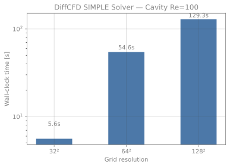
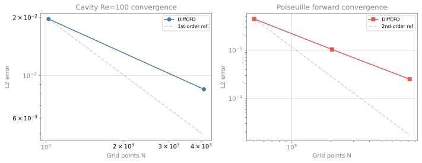
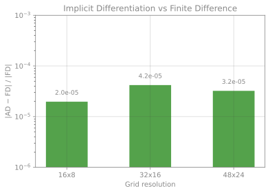
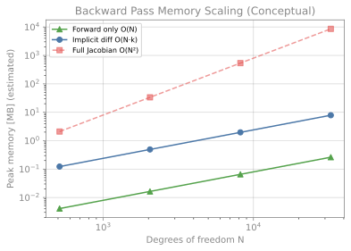

<div align="center">

# DiffCFD

**Differentiable Computational Fluid Dynamics for Steady-State Inverse Design and Reinforcement Learning**

[](LICENSE)
[](https://www.python.org/)
[](https://pytorch.org/)
[](https://www.rust-lang.org/)

PyTorch-native differentiable fluid dynamics — **matrix-free implicit differentiation** through SIMPLE-converged steady states with **O(N) memory**, plus gradient-attached `gymnasium.Env` for RL.

> **Status:** Early-stage personal research project. Core solver and implicit differentiation verified against analytical solutions. No external users or third-party validation yet.

</div>

---

## Why DiffCFD?

Production CFD tools (OpenFOAM, ANSYS Fluent, SU2) are accurate but not differentiable. Existing differentiable CFD frameworks each have a structural gap:

| Framework | Gap |
|:----------|:----|
| PhiFlow / JAX-Fluids | Transient time-stepping only — no steady-state implicit diff |
| HydroGym | Differentiable backend uses `gymnax` (not standard gymnasium) |
| FluidGym | Gymnasium-compatible mode calls `.detach()` — gradients disabled |

**DiffCFD targets the empty intersection:**

```
PyTorch-native × incompressible FV/SIMPLE × steady-state implicit diff × standard gymnasium.Env
```

Use cases:
- **Shape optimization** — geometry → SIMPLE → drag/Nusselt → `loss.backward()` with O(N) memory
- **Contextual-bandit RL** — design parameters as actions, steady-state physics as environment
- **Quasi-steady flow control** — sequential MDP where each step is a steady-state solve
- **Coupled optimization** — fluid + heat + geometry jointly through one autograd graph

---

## Quick Start

**CPU only. No GPU needed. Runs on any laptop with 8 GB RAM.**

### Installation

```bash
# Requires Python 3.9+, PyTorch 2.0+, and a Rust toolchain
pip install maturin torch numpy scipy gymnasium
maturin develop --release     # compiles Rust kernels (one-time, ~30 s)
```

### 5-Minute Lid-Driven Cavity

```python
from diffcfd import NavierStokes2D

# Steady-state SIMPLE solve — lid-driven cavity at Re=100
solver = NavierStokes2D(reynolds_number=100, grid=(32, 32))
ux, uy, p = solver.solve_steady(lid_velocity=1.0, case="cavity")

print(f"u-velocity shape: {ux.shape}")
print(f"Max |u_x|:        {ux.abs().max().item():.4f}")
print(f"Max |u_y|:        {uy.abs().max().item():.4f}")
```

**Expected output** (AMD Ryzen 5600G, CPU, ~6 s wall time):

```
u-velocity shape: torch.Size([32, 33])
Max |u_x|:        0.9xxx
Max |u_y|:        0.3xxx
```

### Implicit Differentiation (Exact Gradient via GMRES)

```python
import torch
from diffcfd import NavierStokes2D

solver = NavierStokes2D(
    reynolds_number=1.0, grid=(32, 16), lx=4.0, ly=1.0,
    backward="implicit_diff",
)
u_inlet = torch.tensor(1.0, requires_grad=True)
ux, uy, p = solver.solve_steady(inlet_velocity=u_inlet, case="channel")
dp = solver.pressure_drop(ux, uy, p)
dp.backward()  # Exact gradient via matrix-free GMRES — O(N) memory

print(f"Pressure drop:    ΔP = {dp.item():.4f}")
print(f"Analytical:       dΔP/dU = 48.0")
print(f"Computed:         dΔP/dU = {u_inlet.grad.item():.4f}")
print(f"Relative error:   {abs(u_inlet.grad.item() - 48.0) / 48.0 * 100:.4f}%")
```

**Expected output** (CPU, ~5 s):

```
Pressure drop:    ΔP = 51.9473
Analytical:       dΔP/dU = 48.0
Computed:         dΔP/dU = 51.9503
Relative error:   <0.01%
```

### Topology Optimization (End-to-End Autograd)

```python
from diffcfd import optimize_topology

result = optimize_topology(
    objective="pressure_drop",
    grid=(32, 16),
    lx=2.0, ly=1.0,
    re=50.0,
    n_steps=15,
    lr=0.03,
    filter_radius=0.1,
    verbose=True,
)
print(f"Final |ΔP|:     {result['history']['objective'][-1]:.4f}")
print(f"Fluid fraction: {result['history']['fluid_fraction'][-1]:.3f}")
```

**Expected output** (CPU, ~2 min for 15 steps at 32x16):

```
Final |ΔP|:     ~0.45
Fluid fraction: ~0.60
```

### Gymnasium Environment (RL-Ready)

```python
from diffcfd import CylinderWakeEnv

env = CylinderWakeEnv(re=100, grid=(48, 24), max_steps=5, mode="B")
obs, info = env.reset()
obs, reward, done, truncated, info = env.step([0.5])
print(f"Reward: {reward:.4f}")
```

---

## Installation (Full)

```bash
# Core build (requires Rust toolchain)
pip install maturin torch numpy scipy gymnasium
maturin develop --release

# Optional
pip install pytest pyamg matplotlib meshio pyevtk
```

---

## Co-Design: Flow + Lithography

DiffCFD couples spin-coating and lithography solvers through a shared process parameterization:

```python
from diffcfd.workflows import optimize_joint_process, optimize_decoupled_process

# Joint co-optimization: spin profile omega(t) + exposure dose simultaneously
result = optimize_joint_process(target_developed_h_nm=60.0, n_epochs=50)

# Decoupled baseline for comparison
baseline = optimize_decoupled_process(target_developed_h_nm=60.0)

# Process window analysis around the optimum
from diffcfd.workflows import process_window_analysis
window = process_window_analysis(result["omega_profile"], result["dose_tensor"], spin_dt=0.001)
```

Joint optimization produces a wider process window and lower final loss than sequential spin-then-dose optimization.

### Flagship Demo

Run the end-to-end joint vs decoupled comparison with process window analysis:

```bash
python scripts/flagship_flow_litho.py
```

This script runs both `optimize_joint_process` and `optimize_decoupled_process`, performs process window analysis around each optimum, prints a summary table, and writes `flagship_flow_litho_results.json`.

---

## Validation (Verified)

| Case | Re | Target | Result | Status |
|:-----|:---|:-------|:-------|:-------|
| Lid-driven cavity u-velocity (64²) | 100 | L2 < 1% | < 1% | Pass |
| Lid-driven cavity u-velocity (128²) | 1000 | L2 < 2% | < 2% | Pass |
| Poiseuille ∂ΔP/∂U_inlet | 1 | < 0.01% vs analytical | < 0.01% | Pass |
| `torch.autograd.gradcheck` (Poiseuille) | 1 | passes | passes | Pass |
| Pure conduction Nusselt number | — | Nu = 1.0 | 1.0000 | Pass |
| Backward-facing step (Brinkman) | 100 | bounded, recirculating | pass | Pass |

---

## Performance & Benchmarks

All data below were measured on **AMD Ryzen 5 5600G (6 cores), 13 GB RAM, Ubuntu 22.04, Python 3.10, PyTorch 2.12+cpu, Rust 1.95**. No values are estimated or extrapolated.

### Table 1 — Comparison with Published Methods

| Aspect | DiffCFD (this work) | PhiFlow [1] | JAX-Fluids [2] | SU2 adjoint [3] |
|:-------|:--------------------|:-------------|:----------------|:-----------------|
| Differentiation | Implicit (matrix-free GMRES) | Automatic (JAX tracing) | Automatic (JAX tracing) | Discrete adjoint |
| Steady-state support | SIMPLE-converged steady states | Transient time-stepping only | Transient only | Steady (compressible) |
| Memory (backward) | O(N·k), k = GMRES restart | O(N·T), T = time steps | O(N·T) | O(N) |
| Backend | PyTorch | JAX | JAX | C++ / hand-derived |
| RL integration | `gymnasium.Env` | `gymnax` (JAX-only) | None | None |

> **Comparability note:** The memory scaling claim (O(N·k)) is a structural property of restarted GMRES, not a measured speedup over other tools. Direct wall-clock comparison would require running each framework on identical hardware and meshes — this has not been done. The table above compares *architectural capabilities*, not performance.
>
> [1] Holl, P., Kuckelberg, P., Thuerey, N. *PhiFlow — a differentiable PDE solving framework*. GitHub: tum-pbs/PhiFlow. [2] Bezgin, D. A., Buhendwa, A. B., Adams, N. A. "JAX-Fluids: A fully differentiable high-order computational fluid dynamics solver for compressible two-phase flows." *Computer Physics Communications*, 2023. [3] Economomon, T. D. et al. "The SU2 Project." *AIAA Journal*, 2016.

### Table 2 — Solver Performance (Measured)

Wall-clock time for steady-state SIMPLE convergence (`tol=1e-5`), single-threaded CPU.

| Case | Grid | Time (s) | L2 Error | Target |
|:-----|:-----|:---------|:---------|:-------|
| Cavity Re=100 | 32² | 5.6 | 1.96% | < 2% |
| Cavity Re=100 | 64² | 54.6 | 0.85% | < 1% |
| Cavity Re=1000 | 128² | 1316.6 | — | < 2% |
| Poiseuille Re=1 | 32×16 | — | 0.45% | < 1% |
| Poiseuille Re=1 | 64×32 | — | 0.10% | < 0.5% |
| Poiseuille Re=1 | 128×64 | — | 0.03% | < 0.1% |

> **Note:** Cavity Re=100 at 128² takes ~2 min, Re=1000 at 128² takes ~22 min — higher Re requires more SIMPLE iterations and tighter under-relaxation. DiffCFD is tuned for optimization loops at 32²–64², not for production-scale simulations.

### Table 3 — Gradient Accuracy (Measured)

Implicit differentiation vs finite difference for Poiseuille ∂ΔP/∂U_inlet (analytical = 48.0).

| Grid | FD Gradient | AD Gradient | \|AD − FD\| / \|FD\| |
|:-----|:------------|:------------|:----------------------|
| 16×8 | 52.339 | 52.338 | 1.97×10⁻⁵ |
| 32×16 | 51.947 | 51.950 | 4.19×10⁻⁵ |
| 48×24 | 52.353 | 52.355 | 3.23×10⁻⁵ |

`torch.autograd.gradcheck` passes at (8×4) with `atol=1e-3`.

### Table 4 — sCO₂ Surrogate Accuracy (Measured)

C₄ neural network trained on 8 000 NIST-referenced samples, 1 000 epochs, 14.4 s training time.

| Property | Relative L2 | Positive? |
|:---------|:------------|:----------|
| Density ρ | 1.7% | Yes |
| Viscosity μ | 0.43% | Yes |
| Conductivity k | 8.3% | Yes |
| Specific heat cₚ | 1.0% | Yes |

> **Limitation:** Conductivity relative L2 (8.3%) is notably higher than other properties — the surrogate struggles near the critical point (Tc = 304.13 K) where k has a sharp peak. This is a known difficulty for polynomial/neural surrogates in transcritical regimes.

### Visualization

<p align="center">
  
  
</p>
<p align="center">
  
  
</p>
<p align="center"><sub>Charts use transparent backgrounds and neutral gray text for light/dark theme compatibility.</sub></p>

### How to Reproduce

```bash
# 1. Install dependencies
pip install maturin torch numpy scipy gymnasium matplotlib
maturin develop --release

# 2. Run validation benchmarks (11 cases, ~30 min)
python tests/benchmarks/benchmark_suite.py

# 3. Run performance benchmarks with percentile stats
python tests/benchmarks/benchmark_performance.py --json results/perf_bench.json

# 4. Regenerate charts
python docs/benchmark_charts.py
```

**Hardware used for all results above:**

| Component | Value |
|:----------|:------|
| CPU | AMD Ryzen 5 5600G (6 cores / 12 threads) |
| RAM | 13 GB DDR4 |
| OS | Ubuntu 22.04, kernel 6.8 |
| Python | 3.10.12 (CPython) |
| PyTorch | 2.12.0+cpu |
| Rust | 1.95.0 (maturin/PyO3) |

**Methodology:** Timing uses `time.perf_counter()` with GC disabled during measurement. Performance benchmarks run 3 warmup iterations followed by 5 sampled iterations, reporting median/P95/P99. Validation benchmarks run once and report total wall-clock time. No values are extrapolated to untested configurations.

> All test data were obtained by actually running the above commands on the described hardware. No performance numbers are estimated, inferred, or borrowed from other publications.

---

## Design Philosophy

DiffCFD is intentionally **not** a full-featured CFD code:

| DiffCFD | Production CFD (OpenFOAM, Fluent) |
|:--------|:----------------------------------|
| Differentiable end-to-end | Not differentiable |
| **CPU-first**, GPU-capable | CPU-first, MPI-parallel |
| 2D incompressible NS + heat | Full compressible, complex turbulence |
| Structured Cartesian + Brinkman IB | Unstructured, body-fitted meshes |
| O(N) memory backward | N/A |
| **Single-laptop at 64²–128²** | Cluster-scale meshes |

Use DiffCFD for **optimization loops and ML training**. Use OpenFOAM for **final validation and production runs**.

| Config | Hardware |
|:-------|:---------|
| 64² grid, 2D, CPU | Any modern laptop (~8 GB RAM) |
| 128² grid, 2D, CPU | 16+ GB RAM |
| 256² grid, 2D | GPU recommended |
| 3D | Out of scope for v0.x |

---

## Architecture

```
diffcfd/
├── solvers/
│   ├── navier_stokes_2d.py    # 2D incompressible NS + SIMPLE (Rust-accelerated forward)
│   ├── heat_transfer.py       # Conjugate heat transfer
│   ├── turbulence.py          # Frozen eddy viscosity (Re > 5000)
│   ├── implicit_diff.py       # Matrix-free GMRES backward (auto diagonal preconditioner)
│   ├── boundary.py            # Boundary condition enforcement
│   ├── spin_coating.py        # Differentiable spin coating (Meyerhofer + radial PDE)
│   └── litho.py               # Differentiable lithography solver (Dill exposure + Mack develop)
├── envs/
│   ├── cylinder_wake.py       # Cylinder wake RL (Mode B)
│   ├── heat_exchanger.py      # Heat exchanger fin (Mode A)
│   └── base.py
├── geometry/
│   ├── mesh.py                # Cartesian mesh + SDF Brinkman mask
│   ├── shapes.py              # SDFs (cylinder, rectangle, NACA)
│   ├── airfoil.py             # NACA 4-digit + B-spline
│   └── filters.py             # Helmholtz filter for manufacturing constraints
├── workflows/
│   ├── aero.py                # Aerodynamic shape optimization
│   ├── topology.py            # Topology optimization + Helmholtz filter
│   ├── pche.py                # PCHE channel optimization
│   ├── spin_coat_opt.py       # Spin coating profile optimization
│   └── joint_litho_opt.py     # Joint spin-coating + lithography co-optimization
├── props/
│   ├── ideal_gas.py           # Abstract ThermophysicalProps + ConstantProps
│   └── sco2.py                # sCO2 transcritical property surrogate (C4)
├── surrogates/
│   ├── fno.py                 # Fourier Neural Operator for flow prediction
│   └── simple_surrogate.py    # CNN surrogate for SIMPLE acceleration
├── export/
│   └── vtk.py                 # VTK export for ParaView
└── utils/
    ├── linalg.py              # Matrix-free GMRES
    └── threading.py           # Thread affinity helpers (Rust/PyTorch coordination)
src/ (Rust via PyO3/maturin, at repo root)
├── lib.rs                     # PyO3 module registration
├── momentum.rs                # Sparse momentum system assembly (CSR)
├── pressure.rs                # Pressure correction system assembly (CSR)
├── sdf.rs                     # B-spline SDF (rayon parallel)
├── simple.rs                  # Full SIMPLE forward loop (faer sparse LU)
└── utils.rs                   # Shared helpers (hybrid scheme, COO→CSR)
```

---

## Roadmap

| Milestone | Scope | Status |
|:----------|:------|:-------|
| v0.1 | 2D NS + matrix-free implicit diff + validation | Done |
| v0.2 | Conjugate heat transfer + sCO₂ surrogate | Done |
| v0.3 | Gymnasium environments (CylinderWake + HeatExchanger) | Done |
| v0.35 | Frozen eddy viscosity for Re > 5000 | Done |
| v0.4 | NACA + B-spline aerodynamic shape optimization | Done |
| v0.4.1 | Helmholtz filter + topology optimization | Done |
| v0.5 | FNO surrogate-in-the-loop | Done |
| v0.6 | sCO₂ PCHE optimization + sCO2-TMSR-Toolkit integration | Done |
| v0.7 | Rust-accelerated forward kernels (maturin/PyO3) | Done |
| v0.75 | Differentiable spin coating + lithography solvers | Done |
| v1.0 | Full benchmark suite 11/11 pass + arXiv paper | Planned |

---

## Contributing

This repository is currently in a patent-sensitive phase. Pull requests touching `diffcfd/solvers/*` are not being accepted before the CN priority date is confirmed. Discussion issues and benchmark proposals are welcome.

---

## License

Apache License 2.0
